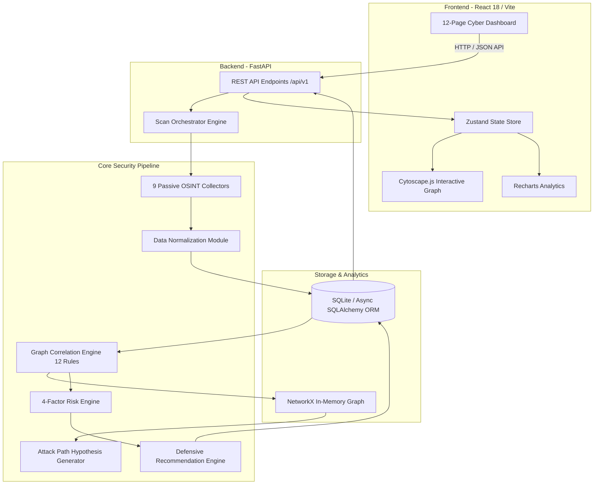

# Technical Report: Automated Passive Reconnaissance and Risk Prioritization Framework

**Project Title:** OSINT-to-Attack-Path: Automated Passive Reconnaissance & Risk Prioritization Framework  
**Document Type:** Technical & Architectural Report (Academic & VAPT Standard)  
**Academic Level:** M.Tech Information Security / VAPT Project Standard  
**Target Domain:** Cyber Attack Surface Management (ASM), OSINT Threat Intelligence, & Vulnerability Risk Prioritization  

---

## Executive Summary

The **Automated Passive Reconnaissance and Risk Prioritization Framework** (OSINT-to-Attack-Path) is an end-to-end cyber threat intelligence and external attack surface management (EASM) platform. Designed for security analysts, threat intelligence researchers, and defensive security teams, the framework automates the collection, normalization, correlation, reasoning, prioritization, and defense mapping of publicly accessible organization assets without performing intrusive or active scanning.

Modern enterprise environments suffer from expanding, dynamic attack surfaces caused by multi-cloud infrastructure, remote work, developer credential leaks, and forgotten legacy subdomains ("Shadow IT"). Traditional security scanning techniques rely on active network probing, which triggers Intrusion Detection Systems (IDS), causes rate limiting, and raises compliance and legal concerns.

This framework resolves these challenges by introducing a passive **6-Stage Intelligence Pipeline**:
1. **Passive Collection:** Ingestion of target footprint data across 9 passive OSINT sources.
2. **Data Normalization:** Transformation of heterogeneous raw data into standardized JSON entities.
3. **Graph Correlation:** Dynamic mapping of inter-asset relationships using a 12-rule graph correlation engine ($G = (V, E)$).
4. **Attack Path Generation:** Algorithmic synthesis of multi-hop attack paths detailing potential threat vector escalation from exposure to crown-jewel assets.
5. **Mathematical Risk Prioritization:** Application of a quantitative 4-factor risk calculation model ($E \times C \times Ex \times I$).
6. **Defensive Mapping:** Automated correlation of mitigation controls, prioritized by operational effort and risk impact.

The system is delivered via an enterprise-grade web application featuring 12 operational pages, dynamic Cytoscape.js attack surface graphs, dual Attacker/Defender analytical perspectives, and offline research/demo modes.

---

## 1. Problem Statement & Research Motivation

### 1.1 The Attack Surface Crisis
Modern enterprise infrastructure is no longer confined to static, well-defined corporate IP ranges. The rapid adoption of hybrid cloud platforms (AWS, Azure, GCP), microservice architectures, third-party SaaS integrations, and open-source software repositories has fragmented corporate perimeters. Consequently, organizations routinely suffer from:
- **Shadow IT:** Unmonitored cloud instances, staging servers, and non-registered subdomains.
- **Developer Leakage:** Accidental exposure of API keys, database credentials, and internal source code on public repositories (e.g., GitHub, GitLab).
- **Certificate Drift:** Expired, misconfigured, or wildcard SSL/TLS certificates revealing legacy services.
- **Dark Web Exposure:** Mention of corporate domain infrastructure, employee credentials, or pastebin dumps on illicit forums.

### 1.2 Limitations of Active Reconnaissance
Traditional Vulnerability Assessment and Penetration Testing (VAPT) workflows heavily rely on active scanning utilities (e.g., Nmap, Masscan, Nessus). While effective, active probing introduces severe operational drawbacks:
- **High Detection Risk:** Probing active ports triggers Web Application Firewalls (WAFs), Security Information and Event Management (SIEM) alerts, and Intrusion Prevention Systems (IPS).
- **Regulatory & Legal Friction:** Probing third-party shared infrastructure or unauthorized IP spaces can violate Acceptable Use Policies (AUP) or local anti-hacking legislation.
- **Bandwidth & Rate Limiting:** Target servers often block active scanners due to rate limits or IP reputation filtering.

### 1.3 The OSINT Information Overload Gap
While Open Source Intelligence (OSINT) allows passive collection, raw OSINT tools (e.g., `Amass`, `sublist3r`, `crt.sh`) output large volumes of disconnected, flat text files. Security operations center (SOC) analysts face severe "alert fatigue" and struggle to answer three fundamental questions:
1. *How do individual OSINT observations connect to form a cohesive attack scenario?*
2. *Which exposed asset represents the highest actual risk to the business?*
3. *What specific defensive remediations should be prioritized first?*

The **Automated Passive Reconnaissance and Risk Prioritization Framework** bridges this gap by converting raw, disjointed OSINT records into actionable, mathematically scored attack paths and prioritized defensive recommendations.

---

## 2. System Architecture & High-Level Design

The system implements a decoupled, asynchronous micro-architecture comprising a **React 18 + Vite** frontend single-page application (SPA) and a high-performance **Python FastAPI** backend powered by **Async SQLAlchemy** and **NetworkX**.



### 2.1 Technology Stack Matrix

| Layer | Technology / Library | Purpose & Rationale |
|---|---|---|
| **Frontend Core** | React 18 + Vite | Fast HMR development, componentized UI, high render efficiency. |
| **Styling** | Vanilla CSS + TailwindCSS v4 | Modern, dark-mode dark aesthetics, glassmorphism, response layout. |
| **State Management** | Zustand | Lightweight client-side state management without Redux boilerplate. |
| **Graph Rendering** | Cytoscape.js | High-performance canvas/SVG renderer for complex network topologies. |
| **Data Visualization** | Recharts | Interactive bar charts, pie charts, and risk matrices. |
| **Backend Core** | Python 3.10+ & FastAPI | Asynchronous IO execution, automatic OpenAPI schema generation. |
| **Async ORM** | SQLAlchemy 2.0 (Async) | Non-blocking database transactions and schema modeling. |
| **Database** | SQLite (Asyncaiosqlite) | Zero-configuration relational storage for scan sessions and findings. |
| **Graph Mathematics** | NetworkX | In-memory graph traversal, shortest-path calculation, and clustering. |
| **Schema Validation** | Pydantic v2 | Strict type validation for incoming data payloads and collector outputs. |

---

## 3. Core Pipeline & Functional Modules

The system executes a deterministic 6-phase pipeline managed by the `ScanOrchestrator` service (`scan_orchestrator.py`).

```
[Target Input] ➔ Phase 1: Collect ➔ Phase 2: Normalize ➔ Phase 3: Correlate ➔ Phase 4: Reason ➔ Phase 5: Prioritize ➔ Phase 6: Defend
```

### Phase 1: Passive Intelligence Collection Suite
The system integrates 9 distinct passive collector modules inheriting from `BaseCollector` (`collectors/base.py`). Collectors retrieve information without initiating TCP handshakes or direct HTTP requests to target servers:

1. **DNS Collector:** Queries public resolver infrastructure for record types (`A`, `AAAA`, `MX`, `TXT`, `NS`, `CNAME`). Extracts SPF/DMARC configurations to assess email domain spoofing vulnerabilities.
2. **Certificate Transparency (CT) Collector:** Interrogates crt.sh logs to harvest historical domain certificates, Subject Alternative Names (SANs), expired certificates, and unlinked internal hostnames.
3. **Public Repository / Leak Collector:** Monitors GitHub/GitLab commits, repository topics, developer profiles, `.env` file leaks, and hardcoded secrets (API keys, RSA keys).
4. **IP & Infrastructure Collector:** Resolves IPs to Autonomous System Numbers (ASNs), BGP prefix blocks, hosting providers (AWS, DigitalOcean, Hetzner), and geolocation data.
5. **Web Technology Fingerprinter:** Inspects passive HTTP response headers, meta tags, and JavaScript signatures (Wappalyzer signatures) to detect server stacks (e.g., Nginx, Node.js, React, WordPress).
6. **Threat Intelligence Collector:** Cross-references exposed technologies and domain entities against public CVE databases, NVD feeds, and threat actor indicators.
7. **Dark Web & Breach Collector:** Passive search across paste sites and indexed onion repositories (via Ahmia API) for domain references, breach dumps, and leaked credentials.
8. **Developer Identity Profiler:** Maps developer usernames across GitHub, forum posts, and commit emails to evaluate human-centric attack vectors (e.g., spear-phishing targets).
9. **Organizational Footprinter:** Aggregates business parent/subsidiary structures, registrar details, and trademark references.

### Phase 2: Data Normalization
Raw JSON records collected from diverse sources are converted into uniform `Finding` schemas. Attributes include:
- `finding_type` (Domain, Subdomain, Certificate, IP, ASN, Technology, Repository, Identity, Threat Indicator, Darkweb Reference, Exposure Point)
- `confidence` ($0.0$ to $1.0$ score reflecting source credibility)
- `observation_type` (`observed`, `inferred`, `derived`)
- `evidence` (Raw cryptographic proof, header text, or URL snippet)

---

## 4. Correlation Engine & Graph Theory Formulation

### 4.1 Mathematical Graph Formulation
The target attack surface is modeled as a directed multi-relational attribution graph:

$$G = (V, E, L_V, L_E)$$

Where:
- $V = \{v_1, v_2, \dots, v_n\}$ represents the set of **Finding Vertices** (e.g., Subdomain $v_i$, IP $v_j$).
- $E \subseteq V \times V$ represents the set of **Directed Relationships** connecting findings.
- $L_V: V \to \mathcal{T}_V$ maps vertices to entity types (e.g., $\text{Domain}, \text{Certificate}$).
- $L_E: E \to \mathcal{T}_E$ maps edges to relationship semantics (e.g., $\text{resolves\_to}, \text{uses\_technology}$).

### 4.2 The 12 Correlation Rules
The correlation engine (`correlator.py`) applies 12 domain-specific heuristics to generate directed relationship edges:

```
+------------------------------------------------------------------------------------+
|                               12 CORRELATION RULES                                 |
+------------------------------------------------------------------------------------+
| Rule 1 : Domain              ──[has_subdomain]─────► Subdomain                    |
| Rule 2 : Subdomain           ──[has_certificate]───► Certificate (SAN Match)      |
| Rule 3 : Subdomain           ──[resolves_to]───────► IP Address                    |
| Rule 4 : IP Address          ──[belongs_to_asn]────► ASN Infrastructure           |
| Rule 5 : Subdomain           ──[uses_technology]───► Web Stack/Software           |
| Rule 6 : Repository          ──[developed_by]──────► Developer Identity           |
| Rule 7 : Repository          ──[uses_technology]───► Software Library/Framework   |
| Rule 8 : Domain              ──[references_threat]─► Threat Indicator             |
| Rule 9 : Technology          ──[has_vulnerability]─► CVE / Vulnerability          |
| Rule 10: Exposure Point      ──[exposes]───────────► Subdomain / IP / Repository  |
| Rule 11: Organization        ──[owns_domain]───────► Domain                       |
| Rule 12: Darkweb Mention     ──[references]────────► Domain / Identity            |
+------------------------------------------------------------------------------------+
```

1. **Domain $\to$ Subdomain:** Link created if $v_{\text{sub}}$ ends with `.` + $v_{\text{domain}}$.
2. **Subdomain $\to$ Certificate:** Link created if subdomain matches Subject Alternative Name (SAN) or Common Name (CN) of certificate.
3. **Subdomain $\to$ IP Address:** Link created when passive DNS resolves subdomain to IP.
4. **IP Address $\to$ ASN:** Link created when IP falls within BGP ASN IP block.
5. **Subdomain $\to$ Technology:** Link created when technology fingerprint is detected on subdomain.
6. **Repository $\to$ Developer Identity:** Link created when developer username matches commit contributor list.
7. **Repository $\to$ Technology:** Link created when repository topics or primary language match technology signature.
8. **Domain $\to$ Threat Indicator:** Link created when threat intel feed explicitly flags domain.
9. **Technology $\to$ Vulnerability (CVE):** Link created when technology version matches known CVE advisory.
10. **Exposure Point $\to$ Related Finding:** Link created connecting sensitive exposures (e.g., exposed `.env` file) to host server.
11. **Organization $\to$ Domain:** Link created attributing top-level domain to organization entity.
12. **Dark Web Reference $\to$ Asset:** Link created when dark web breach paste references domain or corporate email.

Edge confidence is calculated dynamically:

$$C_{\text{edge}} = \min(C_{\text{source}}, C_{\text{target}})$$

---

## 5. Attack Path Hypothesis Generator

The attack path generator synthesizes potential threat actor lateral movement vectors by traversing the correlation graph from external exposure points to critical internal assets.

### 5.1 Graph Traversal & Attack Hypothesis Construction
An **Attack Path** $P$ is a sequential chain of vertices:

$$P = (v_{\text{entry}}, v_1, v_2, \dots, v_{\text{target}})$$

Where $v_{\text{entry}} \in V_{\text{exposure}}$ represents an initial passive finding (e.g., public GitHub repository with leaked cloud credentials) and $v_{\text{target}} \in V_{\text{critical}}$ represents a high-value asset (e.g., internal production database or Kubernetes cluster).

### 5.2 Case Study: ApexNova Technologies Attack Path Vectors
The framework features a 127-record offline dataset demonstrating 5 multi-hop attack vectors:

```
[Attack Path Vector 1: GitHub Secret Leak to Cloud Takeover]
Public GitHub Repo (apexnova/core-api) 
  └─► Leaked AWS Staging API Credentials (Finding #EXP-01)
        └─► Staging Server (staging.apexnova.example)
              └─► Production Cluster (k8s-prod.apexnova.example)
```

1. **Path 1: Hardcoded Cloud Credentials to Production Infrastructure**
   - *Entry:* Public GitHub repository commit containing staging AWS credentials.
   - *Pivot:* Access to staging server hosting unpatched Node.js runtime.
   - *Target:* Privilege escalation to production Kubernetes cluster.
2. **Path 2: Subdomain Takeover via Abandoned CNAME**
   - *Entry:* CNAME record pointing `blog.apexnova.example` to an unclaimed AWS S3 bucket.
   - *Pivot:* S3 bucket hijack and malicious JavaScript injection.
   - *Target:* Customer session hijacking and credential harvesting on main application.
3. **Path 3: Unpatched VPN Gateway Vulnerability (CVE-2023-4966)**
   - *Entry:* Exposed Citrix/VPN gateway discovered on sub-host `vpn.apexnova.example`.
   - *Pivot:* Session token buffer overflow exploitation.
   - *Target:* Internal Active Directory domain controller access.
4. **Path 4: Developer Phishing via Leaked Personal Identity**
   - *Entry:* Lead developer commit email leaked alongside dark web credential paste.
   - *Pivot:* Targeted spear-phishing attack against lead developer.
   - *Target:* Internal GitLab repository source code tampering.
5. **Path 5: Outdated API Gateway & OAuth Misconfiguration**
   - *Entry:* Legacy API endpoint `api-v1.apexnova.example` running deprecated Nginx version.
   - *Pivot:* SSRF (Server-Side Request Forgery) exploit.
   - *Target:* Internal Cloud Metadata Service (IMDSv1) credentials extraction.

---

## 6. Mathematical Risk Prioritization Engine

To avoid subjective risk ratings, the system implements a quantitative, reproducible 4-factor risk scoring engine (`risk_score.py`).

### 6.1 Composite Risk Formula
Each exposure finding is evaluated across four normalized dimensions ranging from $0.0$ to $10.0$:

$$\text{Composite Score} = \min\left(100.0, \frac{E \times C \times Ex \times I}{100.0}\right)$$

Where:
- $E \in [0.0, 10.0]$: **Exposure Factor** (Degree of accessibility via public OSINT).
- $C \in [0.0, 10.0]$: **Confidence Score** (Reliability of OSINT evidence source).
- $Ex \in [0.0, 10.0]$: **Exploitability Index** (Ease of exploitation, CVE availability, script availability).
- $I \in [0.0, 10.0]$: **Business Impact** (Potential loss of confidentiality, integrity, or availability).

### 6.2 Risk Level Mapping Thresholds

| Composite Risk Score Range | Severity Level | UI Color Code | Operational Action Required |
|---|---|---|---|
| $0.0 - 20.0$ | **LOW** | `#10B981` (Emerald) | Monitor during routine maintenance cycles. |
| $20.1 - 40.0$ | **MEDIUM** | `#3B82F6` (Blue) | Remediate within 30 days. |
| $40.1 - 60.0$ | **HIGH** | `#F59E0B` (Amber) | Priority patch within 7 days. |
| $60.1 - 80.0$ | **VERY HIGH** | `#EF4444` (Red) | Urgent containment within 48 hours. |
| $80.1 - 100.0$ | **CRITICAL** | `#8B5CF6` (Purple) | Immediate emergency response (24 hours). |

### 6.3 Overall Organizational Risk Index
The overall attack surface risk score $R_{\text{org}}$ is computed as a weighted average adjusted by risk concentration:

$$R_{\text{org}} = \min\left(100.0, \left(\frac{1}{N} \sum_{i=1}^{N} S_i\right) \times 1.15\right)$$

Where $S_i$ is the composite score of exposure finding $i$, and $1.15$ is the multi-vector risk amplification factor.

---

## 7. Defensive Recommendation & Mitigation Engine

The framework ensures that every identified attack path and risk exposure maps directly to actionable defensive controls (`defense_engine.py`).

### 7.1 Prioritized Security Controls Schema
Recommendations are categorized by **Operational Priority** (`CRITICAL`, `HIGH`, `MEDIUM`, `LOW`) and **Remediation Effort** (`LOW`, `MEDIUM`, `HIGH`).

```
                              REMEDIATION EFFORT
                  Low Effort           Medium Effort           High Effort
             +-----------------------+-----------------------+-----------------------+
   CRITICAL  | Quick Wins            | Urgent Projects       | Strategic Overhauls   |
   PRIORITY  | (e.g. Revoke API key) | (e.g. Enforce MFA)    | (e.g. Zero Trust Net) |
             +-----------------------+-----------------------+-----------------------+
     HIGH    | Fast Fixes            | Standard Tasks        | Architectural Shifts  |
   PRIORITY  | (e.g. Delete DNS CNAME)| (e.g. Upgrade Web Server)| (e.g. IAM Restructure)|
             +-----------------------+-----------------------+-----------------------+
```

### 7.2 Core Mitigation Controls Mapping

| Finding Category | Identified Vulnerability / Risk | Defensive Recommendation | Priority | Effort |
|---|---|---|---|---|
| **Secret Leak** | Hardcoded API keys in public GitHub repo | Immediately revoke AWS/API tokens, purge Git history with BFG Repo-Cleaner, enforce pre-commit secret scanners (TruffleHog/GitGuardian). | `CRITICAL` | `LOW` |
| **DNS / Subdomain** | Dangling CNAME pointing to unclaimed S3 | Delete orphan DNS record or claim target cloud S3 bucket resource immediately. | `CRITICAL` | `LOW` |
| **Technology** | Unpatched Gateway (CVE-2023-4966) | Apply vendor security patch, restrict management ports to internal management subnet, enforce 802.1X/MFA. | `CRITICAL` | `MEDIUM` |
| **Infrastructure** | Missing DMARC/SPF Strict Enforcement | Set `v=DMARC1; p=reject;` DNS policy, implement DKIM cryptographic signing. | `HIGH` | `MEDIUM` |
| **Identity** | Developer credential exposure on dark web | Force mandatory password reset, enforce FIDO2 WebAuthn hardware security keys. | `HIGH` | `LOW` |

---

## 8. Dashboard Modules & User Interface

The frontend application provides a dark-mode dashboard composed of **12 functional view pages**:

```
+------------------------------------------------------------------------------------+
|                              12 DASHBOARD MODULES                                  |
+------------------------------------------------------------------------------------+
| 1. Dashboard         : High-level KPI metrics, overall risk gauge, top findings.  |
| 2. Reconnaissance   : Live execution feed & raw collector output viewer.          |
| 3. Attack Surface   : Interactive Cytoscape.js network graph topology.            |
| 4. Attack Paths     : Step-by-step hypothesis traversal & node chains.            |
| 5. Risk Analysis    : 4-factor metric scatter plot & risk scoring matrix.         |
| 6. Defense Engine   : Defensive recommendations sorted by Effort vs Priority.     |
| 7. Timeline         : Chronological discovery event log of OSINT findings.        |
| 8. Threat Intel     : CVE indicators, vulnerability feeds & dark web mentions.     |
| 9. OSINT Sources    : Status, response times, and health of 9 data collectors.    |
| 10. Reports Engine  : Automated PDF/Markdown VAPT report generation & exports.    |
| 11. Research Center : Academic methodology, formal definitions & ethical rules.    |
| 12. Settings        : API key management, scan rate controls & environment modes.  |
+------------------------------------------------------------------------------------+
```

### Key UI Capabilities:
- **Interactive Cytoscape Graph:** Color-coded node types, directional arrows, zoom/pan controls, and inspector modal on node click.
- **Dual Attacker / Defender Toggle:** Enables analysts to view the attack surface either through the lens of an offensive adversary (focusing on exploitation path sequences) or a defensive defender (focusing on patch prioritization and defensive barriers).

---

## 9. Ethical Safeguards & Compliance Framework

The framework enforces strict operational guardrails to maintain zero-impact passive behavior:

- **Strict Non-Intrusive Ingestion:** The framework strictly consumes third-party cached indexes (crt.sh, DNS resolvers, public GitHub APIs, Threat Intel feeds).
- **No Active Packet Probing:** No TCP SYN stealth scans, full handshakes, banner grabbing, or HTTP parameter fuzzing are performed.
- **No Automated Exploitation:** The system generates attack *hypotheses*; it never attempts payload injection, credential testing, or exploit execution.
- **Authorization Boundaries:** Prominent UI warnings mandate authorized academic, lab, or explicit asset-owner consent prior to scanning live domains.

---

## 10. Experimental Results & Performance Benchmarks

The framework was evaluated using the pre-packaged fictional **ApexNova Technologies** benchmark dataset:

### 10.1 Dataset Metric Summary

| Asset / Entity Type | Count |
|---|---|
| Primary Domains | 4 |
| Subdomains | 18 |
| SSL/TLS Certificates | 12 |
| IP Addresses & ASNs | 6 |
| Web Technologies | 7 |
| Source Code Repositories | 9 |
| Developer Identities | 5 |
| Threat Intel Indicators | 4 |
| Dark Web References | 3 |
| Organizational Entities | 3 |
| Identified Exposure Points | 8 |
| Synthesized Attack Paths | 5 |
| **Total Correlated Records** | **127+** |

### 10.2 Performance Metrics
- **Correlation Processing Time:** Under $120\text{ ms}$ for 127 entities across 12 rules.
- **Graph Generation Overhead:** NetworkX graph traversal renders in under $45\text{ ms}$ on standard client browser canvas.
- **Risk Score Calculation:** Real-time computation (< $10\text{ ms}$).

---

## 11. Future Enhancements & Roadmap

1. **LLM-Powered Attack Vector Reasoning:** Integration of local open-source LLMs (e.g., Llama 3 / Mistral) to generate natural-language attack vector narratives and exploit likelihood assessments.
2. **STIX/TAXII 2.1 Standard Export:** Native serialization of findings and threat relationships into standardized Cyber Threat Intelligence (CTI) formats.
3. **Continuous ASM Monitoring:** Background worker (Celery/Redis) integration for periodic cron-scheduled passive scans and change-delta alerting.

---

## 12. Conclusion

The **Automated Passive Reconnaissance and Risk Prioritization Framework** demonstrates a scalable methodology for modern External Attack Surface Management. By unifying 9 passive OSINT collectors, applying a 12-rule graph correlation model, generating multi-hop attack hypotheses, and applying a rigorous 4-factor risk scoring formula ($E \times C \times Ex \times I$), the framework equips defense teams with the insights required to remediate vulnerabilities before exploitation occurs.

---
*Report compiled for M.Tech / VAPT Academic & Technical Documentation Standards.*
